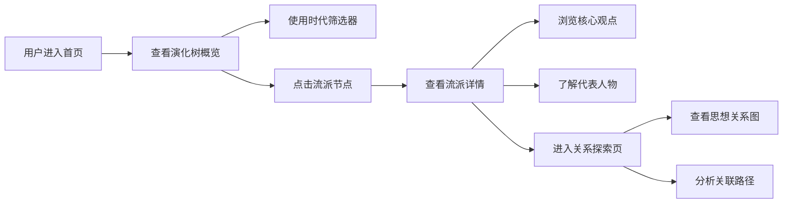

## 1. 产品概述

中国哲学学习与探索平台，以交互式可视化演化树的形式，系统呈现从先秦到宋明时期中国哲学思想的发展脉络与流派传承。不同于传统百科式罗列，平台通过动态关系图让用户直观理解各流派之间的思想渊源、相互影响与演变历程，为国学爱好者、学生和研究者提供沉浸式的中国哲学探索体验。

## 2. 核心功能

### 2.1 用户角色
| 角色 | 注册方式 | 核心权限 |
|------|---------|----------|
| 访客用户 | 无需注册 | 浏览演化树、查看流派详情、探索思想关系图 |

### 2.2 功能模块
1. **首页**：哲学演化树主视图、导航栏、流派概览、时代筛选
2. **流派详情页**：流派详细介绍、核心观点、代表人物、思想演变时间线
3. **关系探索页**：交互式思想关系图、流派关联路径、人物师承关系

### 2.3 页面详情
| 页面名称 | 模块名称 | 功能描述 |
|---------|---------|----------|
| 首页 | 演化树主视图 | SVG交互式树状图，展示从先秦到宋明的哲学流派演化，节点可点击 |
| 首页 | 流派概览卡片 | 展示儒家、道家、法家、墨家、名家、阴阳家等主要流派的简介卡片 |
| 首页 | 时代筛选器 | 按朝代/时期筛选显示的流派节点（先秦、两汉、魏晋、隋唐、宋明） |
| 流派详情页 | 流派信息面板 | 显示流派名称、时期、简介、核心观点、代表著作 |
| 流派详情页 | 代表人物列表 | 展示该流派的重要哲学家及其核心思想、生卒年份 |
| 流派详情页 | 思想演变时间线 | 可视化展示该流派在不同历史时期的发展与分化 |
| 关系探索页 | 思想关系图 | 力导向图展示各流派之间的影响、传承、对立关系 |
| 关系探索页 | 关联路径分析 | 高亮显示两个流派/人物之间的思想传承路径 |

## 3. 核心流程

用户进入首页，首先看到完整的哲学演化树概览。可以通过时代筛选器聚焦特定历史时期，或直接点击感兴趣的流派节点。点击节点后展开该流派的详细信息面板，包含简介、核心观点和代表人物。用户可进一步点击"探索思想关系"进入关系图页面，查看该流派与其他流派的相互影响，或选择两个节点进行关联路径分析，直观理解中国哲学思想的传承脉络。

## 4. 用户界面设计

### 4.1 设计风格
- **主色调**：宣纸米白 (#F5F0E6) 为底色，配以墨黑 (#2C2416) 为主色，赭石 (#8B4513)、石青 (#1E4D6B)、朱砂 (#A52A2A) 为点缀色
- **设计理念**：新中式水墨风格，融合传统卷轴美学与现代交互设计
- **按钮样式**：圆角矩形，细边框，悬停时有墨晕扩散效果
- **字体选择**：标题使用"Noto Serif SC"宋体类字体，正文使用"Noto Sans SC"，配合少量书法字体点缀
- **布局风格**：卷轴式纵向布局，卡片采用宣纸纹理背景与细线边框
- **图标风格**：线性水墨风格图标，配合印章式点缀元素

### 4.2 页面设计概述
| 页面名称 | 模块名称 | UI元素 |
|---------|---------|--------|
| 首页 | 演化树主视图 | SVG动态树状图，节点带发光效果，连线有渐变动画，节点悬停显示预览卡片 |
| 首页 | 流派概览卡片 | 宣纸纹理卡片，标题配印章图标，悬停上浮效果，点击跳转详情 |
| 流派详情页 | 信息面板 | 卷轴式展开动画，分章节展示，配合古籍插图风格装饰 |
| 流派详情页 | 代表人物列表 | 头像采用圆形篆刻边框，人物简介竖排与横排结合 |
| 关系探索页 | 思想关系图 | 力导向动态图，不同流派用不同颜色区分，连线粗细表示关系强弱 |

### 4.3 响应式设计
- 采用桌面优先设计，移动端自适应布局
- 桌面端：演化树完整展示，三栏布局
- 平板端：演化树可缩放平移，两栏布局
- 移动端：演化树转为列表+节点模式，单栏布局，触摸优化
- 所有交互元素支持触摸操作，保证移动端可用性

### 4.4 动效设计
- 页面加载：卷轴展开动画，元素渐入效果
- 节点悬停：墨晕扩散光晕，连接线条高亮
- 节点点击：涟漪扩散效果，详情面板平滑滑入
- 关系图：节点呼吸动效，连线流动动画表示思想传承
- 滚动触发：内容随滚动渐入，时间线节点逐个点亮
