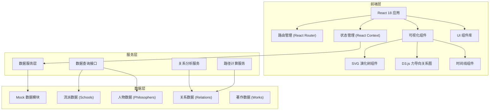
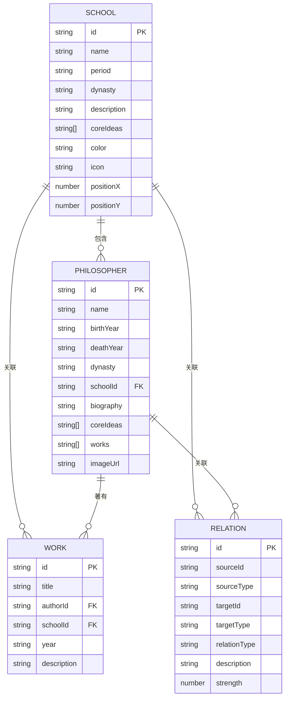

## 1. 架构设计



## 2. 技术描述

- **前端框架**：React@18 + TypeScript
- **构建工具**：Vite@5
- **样式方案**：TailwindCSS@3 + CSS Variables
- **路由管理**：React Router@6
- **可视化库**：D3.js@7（力导向图）+ 原生 SVG（演化树）
- **图标库**：Lucide React（配合自定义水墨风格图标）
- **状态管理**：React Context + useReducer（轻量状态管理）
- **动画库**：Framer Motion（复杂交互动画）
- **后端**：无，纯前端应用，使用 Mock 数据
- **数据持久化**：LocalStorage（用户浏览历史、收藏）

## 3. 路由定义

| 路由 | 页面 | 用途 |
|------|------|------|
| `/` | 首页 | 演化树主视图、流派概览、时代筛选 |
| `/school/:schoolId` | 流派详情页 | 流派详细信息、核心观点、代表人物、时间线 |
| `/relations` | 关系探索页 | 思想关系图、关联路径分析 |
| `/philosopher/:philosopherId` | 人物详情页 | 哲学家生平、核心思想、师承关系 |

## 4. 数据模型

### 4.1 数据模型定义



### 4.2 数据实体说明

#### 流派 (School)
- `id`: 唯一标识（如 `confucianism`, `taoism`）
- `name`: 流派名称
- `period`: 创立时期
- `dynasty`: 所属朝代
- `description`: 流派简介
- `coreIdeas`: 核心观点数组
- `color`: 流派主题色（用于可视化）
- `icon`: 图标名称
- `positionX/Y`: 演化树中的坐标位置

#### 哲学家 (Philosopher)
- `id`: 唯一标识（如 `confucius`, `laozi`）
- `name`: 姓名
- `birthYear/deathYear`: 生卒年份
- `dynasty`: 朝代
- `schoolId`: 所属流派
- `biography`: 生平简介
- `coreIdeas`: 核心思想
- `works`: 代表著作
- `imageUrl`: 头像图片

#### 著作 (Work)
- `id`: 唯一标识
- `title`: 著作名称
- `authorId`: 作者ID
- `schoolId`: 所属流派
- `year`: 成书年代
- `description`: 内容简介

#### 关系 (Relation)
- `id`: 唯一标识
- `sourceId/targetId`: 关联的源和目标
- `sourceType/targetType`: 源/目标类型（`school` 或 `philosopher`）
- `relationType`: 关系类型（`inheritance` 传承, `influence` 影响, `opposition` 对立, `teacher-student` 师承）
- `description`: 关系描述
- `strength`: 关系强度（1-10，用于连线粗细）

### 4.3 Mock 数据结构示例

```typescript
// 流派数据
export const schools: School[] = [
  {
    id: 'confucianism',
    name: '儒家',
    period: '先秦',
    dynasty: '春秋',
    description: '儒家是中国古代最有影响的思想流派之一，由孔子创立，以仁、义、礼、智、信为核心价值观。',
    coreIdeas: ['仁', '义', '礼', '智', '信', '中庸', '克己复礼'],
    color: '#8B4513',
    icon: 'book-open',
    positionX: 200,
    positionY: 300
  },
  // ... 更多流派
];

// 哲学家数据
export const philosophers: Philosopher[] = [
  {
    id: 'confucius',
    name: '孔子',
    birthYear: '前551年',
    deathYear: '前479年',
    dynasty: '春秋',
    schoolId: 'confucianism',
    biography: '名丘，字仲尼，鲁国陬邑人，中国古代思想家、教育家，儒家学派创始人。',
    coreIdeas: ['仁', '礼', '德治', '有教无类'],
    works: ['《论语》', '《诗》', '《书》', '《礼》', '《易》', '《春秋》'],
    imageUrl: '/images/philosophers/confucius.jpg'
  },
  // ... 更多哲学家
];

// 关系数据
export const relations: Relation[] = [
  {
    id: 'r1',
    sourceId: 'confucianism',
    sourceType: 'school',
    targetId: 'mencius',
    targetType: 'philosopher',
    relationType: 'inheritance',
    description: '孟子继承并发展了孔子的儒家思想',
    strength: 9
  },
  // ... 更多关系
];
```

## 5. 核心组件结构

```
src/
├── components/
│   ├── layout/
│   │   ├── Header.tsx          # 导航栏
│   │   └── Footer.tsx          # 页脚
│   ├── evolution-tree/
│   │   ├── EvolutionTree.tsx   # 演化树主组件
│   │   ├── TreeNode.tsx        # 树节点组件
│   │   └── TreeLink.tsx        # 连接线组件
│   ├── relation-graph/
│   │   ├── RelationGraph.tsx   # 关系图主组件
│   │   ├── GraphNode.tsx       # 关系图节点
│   │   └── GraphLink.tsx       # 关系图连线
│   ├── school/
│   │   ├── SchoolCard.tsx      # 流派卡片
│   │   ├── SchoolDetail.tsx    # 流派详情
│   │   └── PhilosopherCard.tsx # 人物卡片
│   └── ui/
│       ├── Button.tsx          # 自定义按钮
│       ├── Card.tsx            # 卡片组件
│       └── Timeline.tsx        # 时间线组件
├── data/
│   ├── schools.ts              # 流派数据
│   ├── philosophers.ts         # 哲学家数据
│   ├── works.ts                # 著作数据
│   └── relations.ts            # 关系数据
├── hooks/
│   ├── useEvolutionTree.ts     # 演化树逻辑Hook
│   └── useRelationGraph.ts     # 关系图逻辑Hook
├── pages/
│   ├── Home.tsx                # 首页
│   ├── SchoolDetail.tsx        # 流派详情页
│   ├── RelationExplorer.tsx    # 关系探索页
│   └── PhilosopherDetail.tsx   # 人物详情页
├── services/
│   └── dataService.ts          # 数据查询服务
├── types/
│   └── index.ts                # TypeScript类型定义
├── App.tsx
├── main.tsx
└── index.css
```

## 6. 性能优化策略

1. **可视化组件优化**
   - 使用 `React.memo` 包装树节点和关系图节点，避免不必要的重渲染
   - SVG 图形使用 `requestAnimationFrame` 进行动画更新
   - 大数据量时采用虚拟滚动和按需渲染

2. **动画性能**
   - 优先使用 CSS transforms 和 opacity 属性实现动画
   - 使用 `will-change` 提示浏览器优化
   - 复杂动画使用 Framer Motion 的 Layout Animations

3. **代码分割**
   - 按页面进行路由级代码分割
   - 可视化库（D3.js）按需加载
   - 大体积数据文件动态导入

4. **图片优化**
   - 使用 WebP 格式图片
   - 实现图片懒加载
   - 提供不同分辨率的响应式图片
